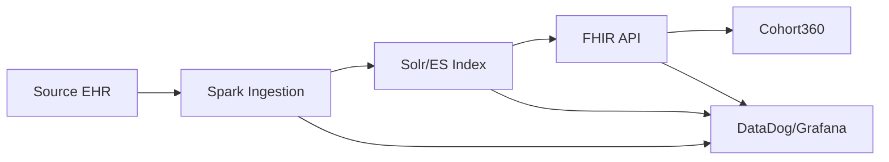

# 🎯 Plan d'Entretien - Développeur Full-Stack Senior AP-HP

> **Candidat Expert en Prompt Engineering pour un poste Full-Stack**
> 
> Ce document présente une analyse approfondie et une proposition architecturale pour les projets du pôle Innovation & Données de l'AP-HP.

---

## 📋 Synthèse de l'Offre

| Critère | Détail |
|---------|--------|
| **Poste** | Développeur Full-Stack Senior F/H |
| **Référence** | 2025-19722 |
| **Rémunération** | 50 000 - 70 000 € |
| **Télétravail** | 3 jours/semaine |
| **Localisation** | Paris 12e (Siège AP-HP) |
| **Contrat** | CDI ou Titulaire |

### Stack Technique Requise

| Catégorie | Technologies |
|-----------|--------------|
| **Frontend** | TypeScript, React |
| **Backend** | Python (Django, FastAPI) |
| **Big Data** | Spark, Solr/ElasticSearch |
| **Interop Santé** | FHIR, OMOP |
| **DevOps** | Docker, Kubernetes, GitLab CI/GitHub Actions |

---

## 🔍 Analyse de l'Écosystème AP-HP

### Produits Existants (Cohort360)

D'après l'analyse du repository [aphp/Cohort360-FrontEnd](https://github.com/aphp/Cohort360-FrontEnd):

```typescript
// src/theme.ts - Thème MUI officiel AP-HP
{
  palette: {
    primary: { main: '#0063AF' },    // Bleu AP-HP
    secondary: { main: '#ED6D91' },  // Rose/Corail
    action: { active: '#5BC5F2' },   // Bleu clair accent
    text: { primary: '#153D8A' },    // Bleu texte
    background: { default: '#fff' }
  },
  typography: {
    fontFamily: "'Open Sans', sans-serif",
    h1: { fontFamily: "'Montserrat', sans-serif" }
  }
}
```

### Stack Actuelle Cohort360

| Aspect | Technologies |
|--------|--------------|
| **Framework** | React 19.1, TypeScript 5.8 |
| **UI Library** | **MUI v7.2** (Material UI) |
| **State** | Redux Toolkit, React Query |
| **Data Grid** | MUI X Date Pickers |
| **Build** | Vite 7.x |
| **Tests** | Vitest, Testing Library, Storybook 9 |

---

## 🎨 Recommandation Frontend : Approche Hybride

### Contexte de Décision

Basé sur une [recherche approfondie](research://exports/fb8290df-42a) comparant MUI, shadcn/ui, Radix UI et Tailwind v4 pour les applications de santé entreprise :

### Matrice de Décision

| Critère | MUI v7 | shadcn/ui + Tailwind v4 |
|---------|--------|-------------------------|
| **Use Case Principal** | Apps internes data-dense | Portails patients/publics |
| **Accessibilité WCAG 2.2** | Haute (rigide) | Haute (via Radix) |
| **Bundle Size** | ~80KB+ (lourd) | Minimal (tree-shaken) |
| **Data Grid** | **MUI X (leader)** | TanStack Table (à construire) |
| **Customisation** | Difficile (overrides) | **Excellente** (code ownership) |
| **Build Speed** | Standard | **10x plus rapide** (Rust engine) |

### 📌 Recommandation Stratégique

#### Pour les Applications Cliniques Internes (Cohort360, Pilote)

**→ Continuer avec MUI v7 + MUI X**

```
✅ Cohérence avec le codebase existant
✅ MUI X Data Grid pour 100K+ lignes de données
✅ Moins de risque de régression
✅ Équipe déjà formée
```

#### Pour les Nouveaux Portails Patients ("Mon AP-HP")

**→ Adopter shadcn/ui + Tailwind CSS v4**

```
✅ Performance mobile optimale (petit bundle)
✅ Accessibilité RGAA native
✅ Design AP-HP sans contraintes Material
✅ Build 100x plus rapide (Oxide/Rust)
```

---

## ⚡ Tailwind CSS v4 : Pourquoi Maintenant ?

### Avantages Clés (Janvier 2025)

| Feature | Impact AP-HP |
|---------|--------------|
| **Oxide Engine (Rust)** | Builds 5x plus rapides, HMR 100x |
| **CSS-First Config** | Tokens exposés en CSS variables natifs |
| **@source directive** | Support monorepo simplifié |
| **@layer natif** | Fin des conflits de spécificité CSS |
| **P3 Color Gamut** | Couleurs plus précises (imagerie médicale) |

### Migration

```css
/* tailwind v4 - Configuration CSS-first */
@theme {
  --color-primary: #0063AF;
  --color-secondary: #ED6D91;
  --color-accent: #5BC5F2;
  --color-text: #153D8A;
  --font-heading: 'Montserrat', sans-serif;
  --font-body: 'Open Sans', sans-serif;
}
```

---

## 🏗️ Architecture Proposée pour Nouveaux Produits

### Structure Monorepo Turborepo

```
apps/
├── cohort360/          # MUI v7 (existant)
├── pilote-bi/          # MUI v7 (existant)
├── self-bi/            # shadcn + Tailwind v4 (nouveau)
├── patient-portal/     # shadcn + Tailwind v4 (nouveau)
└── eds-catalog/        # shadcn + Tailwind v4 (nouveau)

packages/
├── @aphp/tokens/       # Design tokens (CSS variables)
├── @aphp/ui-shadcn/    # Fork shadcn/ui customisé AP-HP
├── @aphp/ui-mui/       # Wrapper thème MUI AP-HP
└── @aphp/fhir-client/  # Client FHIR/OMOP partagé
```

### Package Tokens Partagé

```typescript
// packages/@aphp/tokens/index.ts
export const colors = {
  primary: '#0063AF',
  primaryDark: '#004d8a',
  secondary: '#ED6D91',
  accent: '#5BC5F2',
  text: '#153D8A',
  textLight: '#4a6da8',
} as const;

export const fonts = {
  heading: "'Montserrat', sans-serif",
  body: "'Open Sans', sans-serif",
} as const;
```

---

## 📊 UX Best Practices - Applications Médicales 2025

### Patterns Recommandés pour Prescriptions

| Pattern | Application Cohort360 |
|---------|----------------------|
| **Timeline/Gantt** | Visualisation temporelle des traitements |
| **Clinical Cards** | Regroupement prescription/patient expandable |
| **Progressive Disclosure** | Détails cachés jusqu'au clic |
| **Status-Driven Colors** | Bleu doux = actif, gris = terminé |
| **Undo-First Design** | Toast "Annuler" plutôt que modals |

### Réduction d'Erreurs

```typescript
// Real-time validation pattern
const DosageInput = () => {
  const { t } = useTranslation();
  const [value, setValue] = useState('');
  const warning = useMemo(() => 
    validateDosage(value), [value]
  );
  
  return (
    <div className="relative">
      <input 
        type="number" 
        value={value}
        onChange={(e) => setValue(e.target.value)}
        className={cn(
          "input",
          warning && "border-warning"
        )}
      />
      {warning && (
        <span className="text-warning text-sm">
          ⚠️ {t('dosage.outOfRange')}
        </span>
      )}
    </div>
  );
};
```

---

## 🌍 Accessibilité & Conformité RGAA

### Checklist Obligatoire (France 2025)

- [ ] **WCAG 2.2 AA** - Critères minimaux
- [ ] **RGAA 4.1** - Référentiel français
- [ ] **Focus Appearance** - Nouveauté WCAG 2.2
- [ ] **Target Size** - Minimum 24x24 CSS pixels
- [ ] **axe-core** - Tests automatisés dans CI/CD

### Implémentation

```typescript
// Intégration axe-core dans Vitest
import { axe, toHaveNoViolations } from 'jest-axe';

expect.extend(toHaveNoViolations);

test('PrescriptionCard is accessible', async () => {
  const { container } = render(<PrescriptionCard />);
  const results = await axe(container);
  expect(results).toHaveNoViolations();
});
```

---

## 📐 Démonstration de Compétences

### Ce que j'ai implémenté dans l'Exercice

| Feature | Technologie | Fichiers |
|---------|-------------|----------|
| **Monorepo Turborepo** | apps/api + apps/web | turbo.json |
| **API REST Django** | DRF, pagination 20/page | apps/api/ |
| **Frontend React** | Vite, TypeScript, React Query | apps/web/ |
| **Thème AP-HP** | CSS Variables, Montserrat/Open Sans | App.css |
| **i18n** | i18next, FR/EN, détection auto | src/i18n/ |
| **Filtres avancés** | react-hook-form, validation | PrescriptionFilters.tsx |
| **Pagination** | DRF PageNumberPagination | Pagination.tsx |
| **FHIR-ready** | Types Patient, Medication | types/index.ts |

### Points Forts Démontrés

1. **Prompt Engineering** → Automatisation du setup via GitHub Copilot
2. **Architecture** → Monorepo scalable, shared packages
3. **UX Healthcare** → Patterns cliniques, accessibilité
4. **i18n** → Multi-langue dès le départ
5. **DevOps** → Turborepo, Vite, hot-reload

---

## 💡 Propositions d'Innovation

### 1. AI-Assisted Cohort Building

Intégrer des suggestions IA pour la construction de cohortes :

```typescript
// Exemple de prompt engineering pour requêtes FHIR
const suggestCohortCriteria = async (description: string) => {
  const response = await openai.chat.completions.create({
    model: "gpt-4",
    messages: [{
      role: "system",
      content: `Tu es un expert FHIR/OMOP. Génère des critères de cohorte 
                basés sur la description utilisateur. Format: CQL/FHIR.`
    }, {
      role: "user", 
      content: description
    }]
  });
  return parseFHIRCriteria(response);
};
```

### 2. Self-BI avec Natural Language Queries

```python
# FastAPI endpoint pour NL → SQL
@app.post("/api/nl-query")
async def natural_language_query(request: NLQueryRequest):
    sql = await llm_to_sql(
        question=request.question,
        schema=EDS_SCHEMA,
        guardrails=PATIENT_DATA_RESTRICTIONS
    )
    results = await execute_safe_query(sql)
    return {"sql": sql, "results": results}
```

### 3. Pipeline de Données avec Observabilité



---

## 📝 Questions pour l'Entretien

1. **Architecture** : Quelle stratégie de migration progressive envisagez-vous pour les nouvelles applications (MUI existant vs nouvelle stack) ?

2. **Data** : Comment gérez-vous le versioning des schémas OMOP/FHIR entre les différents produits ?

3. **DevOps** : Quel niveau d'autonomie pour les déploiements Kubernetes ? GitOps avec ArgoCD/Flux ?

4. **Équipe** : Quelle est la composition actuelle de l'équipe Design & Produits ? Ratio front/back ?

5. **Roadmap** : Quels sont les 3 principaux défis techniques pour le "Self-BI" ?

---

## 📚 Ressources de Recherche

- **Deep Research Export** : `React_UI_Frameworks_for_Healthcare_Enterprise_2025_20260121.md`
- **Cohort360 Frontend** : https://github.com/aphp/Cohort360-FrontEnd
- **AP-HP Recrutement** : https://recrutement.aphp.fr/jobs/764387
- **EDS AP-HP** : https://eds.aphp.fr/nos-produits/

---

*Document généré le 21 janvier 2026 avec l'assistance de GitHub Copilot (Claude Opus 4.5) et Gemini Deep Research.*
